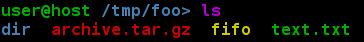
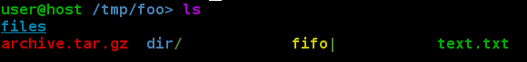
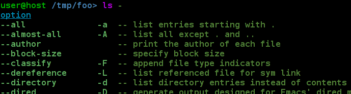
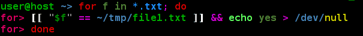
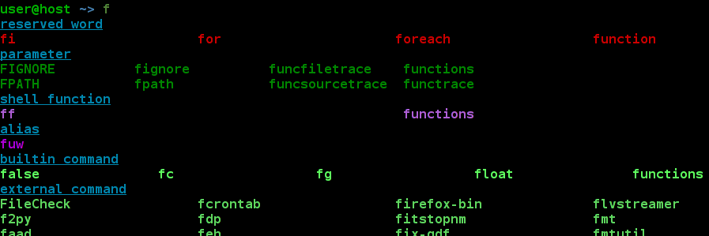
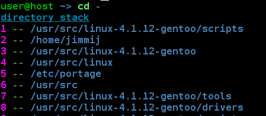
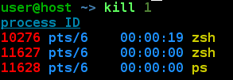
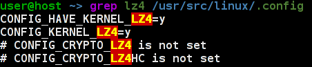

chromatic-zsh
======================================================================
The aim of this project is to provide unified colorful [zsh](http://www.zsh.org) environment.

That includes:
 - completion system
   * commands, functions, aliases, etc.
   * possible commands arguments or options (like directory stack for `cd` or process ids for `kill`)
 - syntax
   * including files according to their attributes
 - searched patterns in history
 - selected regions
 - default color of some commands output (like `less` or `grep`)

All colors are coherent among different context, so that i.e. file.txt is presented always in the color regardless whether its the output of `ls file.txt`, suggestion from completion system or written by hand directly on the command line (see below for examples).

The program check the terminal capability and uses 256 (if possible) or 8 color palette.
All color are configurable.

Installation procedure
----------------------------------------------------------------------
 - Download the script or clone this repository:

        git clone git://github.com/jimmijj/chromatic-zsh.git

 - Add full path of the script at the end of `~/.zshrc`:

        echo '. /path/to/chromatic-zsh/chromatic-zsh.zsh' >>~/.zshrc

 - Start new session with `zsh`.

Examples
----------------------------------------------------------------------

